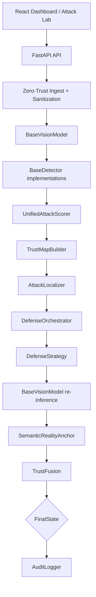
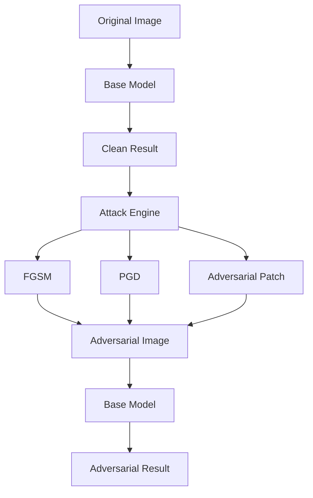
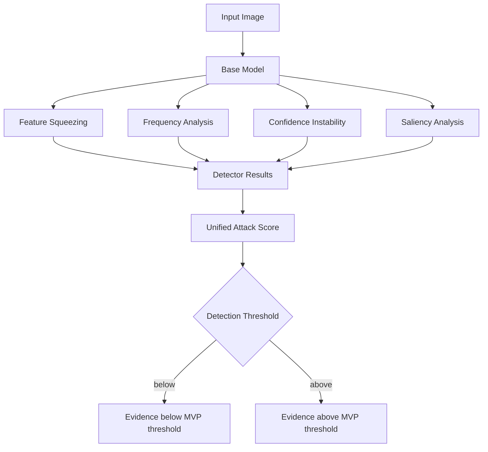
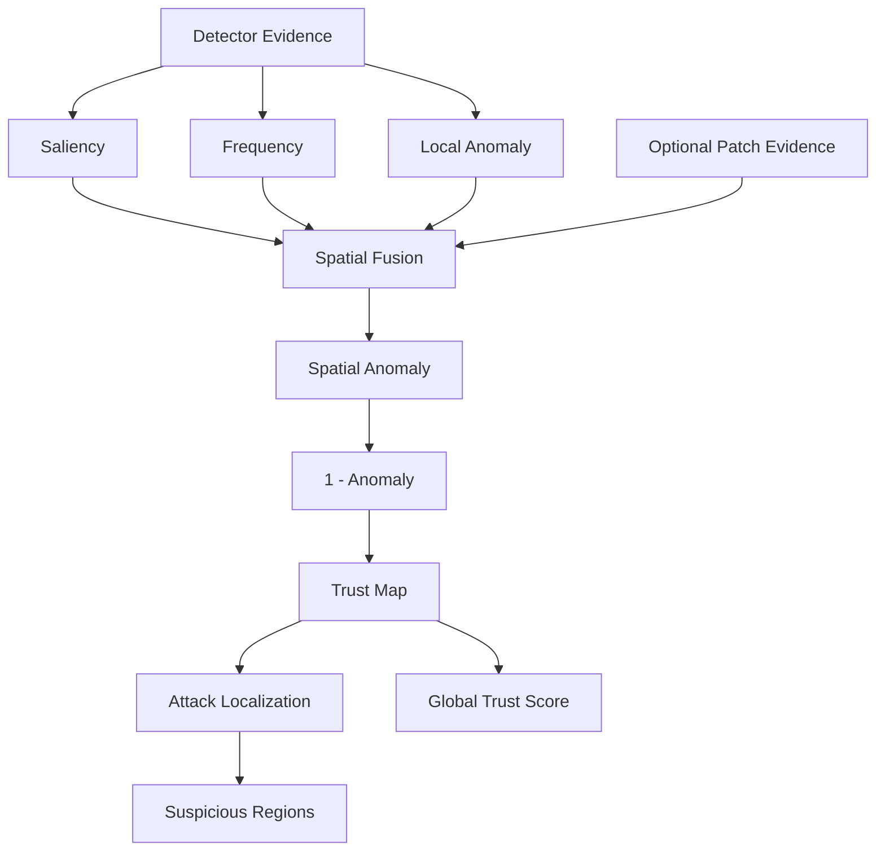
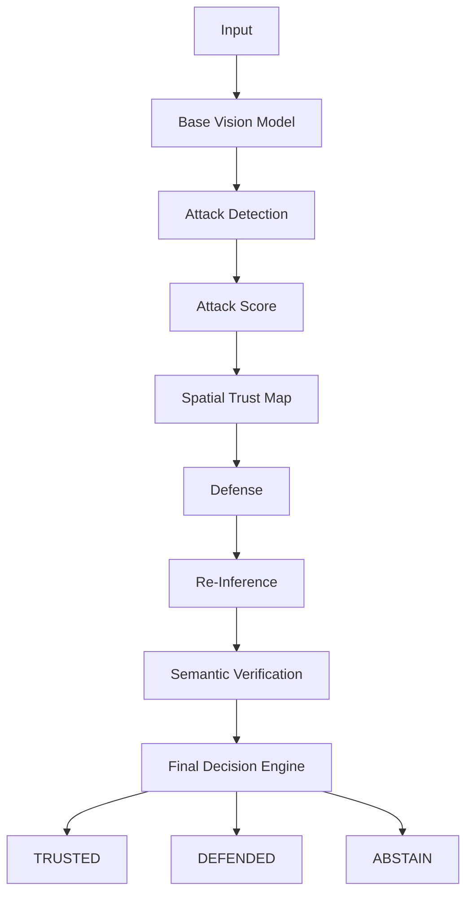
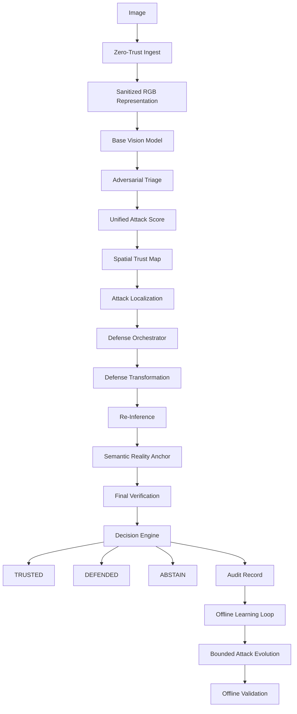
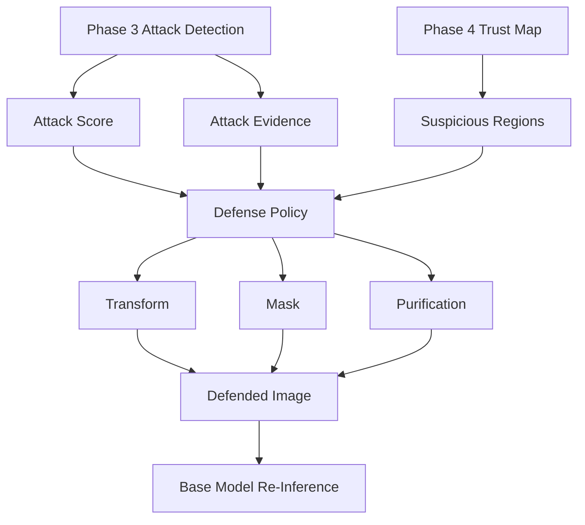
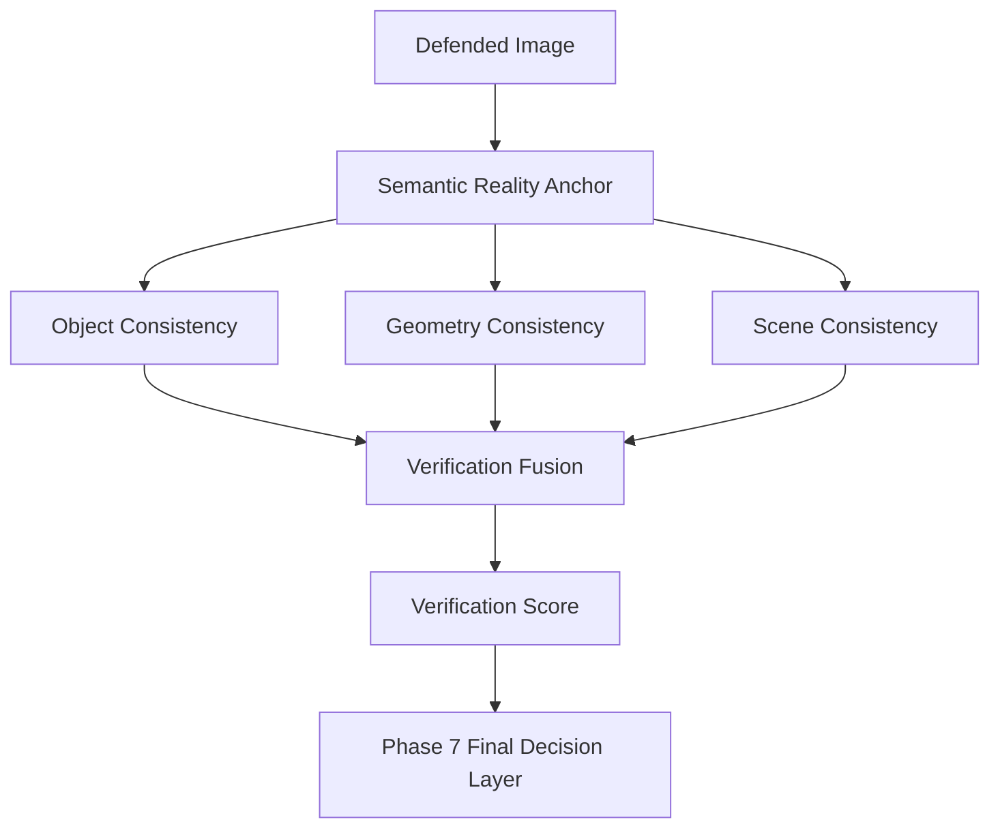

# Architecture

ARGUS-AEGIS is organized as ports and adapters around a staged visual trust pipeline. API routes accept transport-level input and return Pydantic contracts. Domain packages own model, attack, detector, trust, defense, verification, pipeline, and audit behavior.

## Contracts

- `BaseVisionModel.predict(image) -> ModelPrediction`
- `BaseAttack.generate(image, target) -> AttackResult`
- `BaseDetector.detect(image, context) -> DetectorResult`
- `DefenseStrategy.defend(image, trust_map, context) -> DefenseResult`
- `SemanticRealityAnchor.verify(original, defended, context) -> VerificationResult`
- `TrustFusion.fuse(signals) -> TrustFusionResult`
- `AuditLogger.record(event) -> None`

## State Model

Externally visible states are exactly `TRUSTED`, `DEFENDED`, and `ABSTAIN`. Internal stages are represented by `PipelineStage` for traceability and audit correlation.

## Security Boundaries

Uploaded images must be treated as untrusted bytes. Future ingest work must enforce size, MIME, decoding, dimension, and resource limits before model execution. Audit records must be structured, redactable, and append-only before production deployment.

Detector, defense, trust-map, and semantic-verification algorithms remain deferred to later phases.

## Phase 2 Attack Lab

Phase 2 adds a separate attack engine around the baseline model. Attacks operate on RGB pixel tensors and use the same differentiable resize, center crop, and ImageNet normalization path as inference.

The attack registry creates `fgsm`, `pgd`, and `adversarial_patch` adapters. Generated images are returned as temporary data references by the API and are not persisted. The CLI demo may save a local generated artifact under `data/adversarial/`.

## Phase 3 Detection

Each detector provides evidence independently. `UnifiedAttackScorer` performs transparent configurable weighted fusion; the default weights are feature squeezing `0.30`, frequency `0.25`, confidence instability `0.25`, and saliency `0.20`, with a configurable threshold of `0.70`. These are MVP calibration parameters, not mathematically guaranteed detection limits. Phase 3 does not choose defenses or final trust states.

## Phase 4 Spatial Trust Map

Attack Score and Trust Map are different outputs. Attack Score is global evidence of adversarial manipulation from Phase 3. Trust Map is a spatial representation of relative perception confidence, where higher values are more trusted. Localization extracts connected low-trust regions from that map. None of these values are mathematically certified probabilities or final trust states.

## Phase 7 Final Decision

`TRUSTED` requires low attack risk, high global trust, strong verification, and sufficient original confidence. `DEFENDED` requires detected attack evidence, an applied defense, strong verification, and sufficient defended confidence. All contradictory, uncertain, or insufficient-evidence cases map to `ABSTAIN`, which is a deliberate safety mechanism and returns a `NO_ACTION` fallback.

| Condition | Result |
| --- | --- |
| Low attack risk + high trust + strong verification | TRUSTED |
| Attack detected + defense applied + strong verification | DEFENDED |
| Attack detected + weak defense result | ABSTAIN |
| High uncertainty | ABSTAIN |
| Conflicting evidence | ABSTAIN |
| Insufficient confidence | ABSTAIN |

The decision score is a transparent average of inverse attack risk, global trust, verification score, and selected prediction confidence. It is distinct from both Attack Score and Verification Score.

## Phase 10 Offline Learning Loop

```mermaid
flowchart LR
    Audit[Audit Records] --> Failures[Failure Analysis]
    Failures --> Hard[Hard Negatives]
    Hard --> Dataset[Candidate Dataset]
    Dataset --> Evolution[Bounded Attack Evolution]
    Evolution --> Evaluation[Offline Evaluation]
    Evaluation --> Gate[Validation Gate]
    Gate --> Candidate[Candidate Artifact]
    Candidate -->|explicit future promotion| Production[Production]
```

This loop is offline and candidate-only. It does not run during production inference, does not silently tune thresholds, and does not overwrite production models.

## Final Integrated Pipeline

Spatial fusion defaults to saliency `0.30`, frequency `0.25`, local anomaly `0.20`, and patch `0.25`. If a source is unavailable, its weight is removed and the remaining weights are renormalized. Patch masks are optional evaluation metadata and are not required for normal analysis.

## Phase 5 Autonomous Defense

Detection identifies global evidence, the Trust Map identifies spatial risk, policy chooses the least destructive appropriate response, the defense modifies the input, and re-inference measures the result. The policy is transparent and configurable, not guaranteed optimal. Certified inference is represented only as an inactive roadmap placeholder.

## Phase 6 Semantic Reality Anchor

Attack Score asks how much global evidence suggests adversarial manipulation. The Spatial Trust Map asks where perception may be unreliable. Verification Score asks how consistent the defended interpretation remains with available classification, structural, and coarse scene evidence. These signals remain separate, and none is mathematically guaranteed semantic truth.
