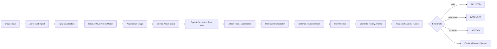

<<<<<<< HEAD
# ARGUS-AEGIS

ARGUS-AEGIS is an MVP architecture for an autonomous adversarial defense and recovery fabric placed between visual inputs and an AI vision or decision model.

The system accepts an image, applies zero-trust ingest and sanitization, evaluates adversarial risk, builds a spatial trust view, selects a defense, re-infers, verifies semantic consistency, and returns one of `TRUSTED`, `DEFENDED`, or `ABSTAIN` with an explainable audit record.

Phase 1 provides clean pretrained ResNet-18 inference. Phase 2 provides an Attack Lab with FGSM, PGD, and a localized adversarial patch. Detection, defense, trust maps, and semantic verification remain later phases.

## Architecture



## Project Structure

- `backend/`: typed FastAPI API and modular security-domain contracts.
- `frontend/`: React + TypeScript + Vite dashboard and Attack Lab placeholders.
- `data/`: raw, processed, adversarial, and sample data boundaries.
- `notebooks/`: experiment entry points for later model and detector work.
- `scripts/`: platform-specific setup, run, and test commands.
- `docs/`: architecture, API, testing, and development guidance.

## Setup

Requirements: Python 3.11+, Node.js 20+, npm, and (optionally) Docker.

### Backend

```powershell
cd backend
python -m venv .venv
.\.venv\Scripts\Activate.ps1
python -m pip install --upgrade pip
pip install -r requirements.txt
```

### Frontend

```powershell
cd frontend
npm install
```

## Attack Lab

Start the backend, then send multipart form requests to `/api/v1/attacks/generate` or `/api/v1/attacks/evaluate`. Supported attacks are `fgsm`, `pgd`, and `adversarial_patch`.

```powershell
curl.exe -X POST http://localhost:8000/api/v1/attacks/generate `
    -F "image=@data/samples/test.jpg" `
    -F "attack=fgsm" `
    -F "epsilon=0.01"

curl.exe -X POST http://localhost:8000/api/v1/attacks/evaluate `
    -F "image=@data/samples/test.jpg" `
    -F "attack=pgd" `
    -F "epsilon=0.03" `
    -F "step_size=0.005" `
    -F "iterations=10" `
    -F "random_start=true"

curl.exe -X POST http://localhost:8000/api/v1/attacks/generate `
    -F "image=@data/samples/test.jpg" `
    -F "attack=adversarial_patch" `
    -F "patch_size=0.2" `
    -F "location=center" `
    -F "iterations=20"
```

Parameters are bounded by the API: epsilon is at most `0.25`, iterations are at most `100`, patch size is between `0.01` and `1`, and patch locations are predefined. Generated images are returned as base64 PNG data references and are not permanently stored.

Run the CLI demo:

```powershell
python scripts/demo_attack.py --image data/samples/test.jpg --attack fgsm
python scripts/demo_attack.py --image data/samples/test.jpg --attack pgd --epsilon 0.03 --step-size 0.005 --iterations 10
python scripts/demo_attack.py --image data/samples/test.jpg --attack adversarial_patch --patch-size 0.2 --location center --iterations 20
```

The demo writes generated images to `data/adversarial/`, which is ignored by Git.

## Detection Lab

Phase 3 analyzes clean or adversarial images with four evidence-producing detectors and a configurable unified scorer. It does not perform defense or final trust fusion.

```powershell
curl.exe -X POST http://localhost:8000/api/v1/detection/analyze `
    -F "image=@data/samples/test.jpg"
```

Optional detector selection and threshold override:

```powershell
curl.exe -X POST http://localhost:8000/api/v1/detection/analyze `
    -F "image=@data/samples/test.jpg" `
    -F "detectors=feature_squeezing,frequency_analysis,saliency_analysis" `
    -F "threshold=0.70"
```

Run the demonstration comparison:

```powershell
python scripts/evaluate_detectors.py
```

The report distinguishes per-detector evidence from the unified attack score and detection threshold. The default script uses small generated samples for a smoke demonstration, not a calibrated benchmark.

## Spatial Trust Map

Phase 4 converts Phase 3 evidence into a spatial perception-confidence map and suspicious connected regions. A trust value of `1.0` means more trusted relative to the image; `0.0` means lower trust. It is not a certified probability or a final decision.

```powershell
curl.exe -X POST http://localhost:8000/api/v1/trust-map/analyze `
    -F "image=@data/samples/test.jpg" `
    -F "localization_threshold=0.30" `
    -F "minimum_region_area=16"
```

Run the local visualization demo:

```powershell
python scripts/demo_trust_map.py --image data/samples/test.jpg
```

For a Phase 2 patch mask, pass it explicitly for evaluation:

```powershell
python scripts/demo_trust_map.py --image data/adversarial/patch_example.png --attack-type patch --patch-mask data/adversarial/patch_mask.png
```

The trust-map API and demo use the same Phase 3 detector pipeline, then derive saliency, local frequency, local-neighborhood, and optional patch evidence maps. Suspicious regions are connected components below the configurable trust threshold, filtered by minimum area.

## Autonomous Defense

Phase 5 consumes the Phase 3 attack score and Phase 4 trust map, applies a transparent policy, executes one MVP defense, and re-runs the baseline model. It does not return a final `TRUSTED`, `DEFENDED`, or `ABSTAIN` state.

```powershell
curl.exe -X POST http://localhost:8000/api/v1/defense/apply `
    -F "image=@data/adversarial/example.png"
```

Run the defense demo:

```powershell
python scripts/demo_defense.py --image data/adversarial/example.png
```

Run the recovery and distortion evaluation smoke script:

```powershell
python scripts/evaluate_defense.py
```

Policy defaults are configurable MVP thresholds: below `0.30` means no defense, moderate evidence selects a lightweight transform, high localized evidence selects masking, and high/distributed evidence selects purification. These values are not scientifically optimal. Generated defended images, overlays, and traces are written to `data/outputs/` and ignored by Git.

## Semantic Verification

Phase 6 compares original and defended interpretations using object, geometry, and coarse scene consistency. It does not produce a final decision state.

```powershell
curl.exe -X POST http://localhost:8000/api/v1/verification/analyze `
    -F "original_image=@data/samples/test.jpg" `
    -F "defended_image=@data/outputs/test_defended.png"
```

Run the full verification demo:

```powershell
python scripts/demo_verification.py --image data/adversarial/example.png
```

The default verification fusion weights are object `0.40`, geometry `0.30`, and scene `0.30`. These are evidence-fusion calibration values, not correctness probabilities.

## Complete Analysis

Phase 7 combines detection, spatial trust, defense, re-inference, and semantic verification into exactly one final state: `TRUSTED`, `DEFENDED`, or `ABSTAIN`.

```powershell
curl.exe -X POST http://localhost:8000/api/v1/analyze `
    -F "image=@data/samples/test.jpg" `
    -F "mode=standard"
```

Run the complete terminal demo:

```powershell
python scripts/demo_argus_aegis.py --image data/samples/test.jpg
```

`ABSTAIN` returns no final prediction and a `NO_ACTION` fallback. Ground-truth attack metadata in evaluation mode is retained as metadata only and never controls the decision.

## Phase 8 Dashboard

Start the frontend:

```powershell
cd frontend
npm install
npm run dev
```

Open `http://localhost:5173` and use the navigation for:

1. Dashboard: upload, run analysis, compare images, inspect risk/trust/verification, and view the decision.
2. Attack Lab: generate FGSM, PGD, or patch inputs and send them through `/api/v1/analyze`.
3. Analysis: inspect the detailed evidence chain.
4. Audit Trail: retrieve persisted decision records and expand evidence details.

The browser uses the backend as the source of truth. It does not calculate security metrics or decision states locally.

## Phase 10 Learning Workbench

Phase 10 is explicitly offline. It mines hard negatives from persisted audit records, evolves bounded attack configurations, evaluates candidates, and applies a validation gate. It never changes production models or live decision thresholds automatically.

```powershell
python scripts/mine_hard_negatives.py
python scripts/run_learning_cycle.py
python scripts/run_attack_evolution.py --image data/samples/test.jpg --attack pgd --generations 3 --population 20 --seed 42
python scripts/validate_candidate.py --metrics candidate_metrics.json
python scripts/demo_learning_cycle.py
```

Use the `Learning` navigation item for `OFFLINE RED TEAM` artifacts, hard-negative counts, failure categories, experiment IDs, and candidate status. See [docs/learning_loop.md](docs/learning_loop.md).

## Security

Phase 11 adds zero-trust image validation, configurable image/resource limits, structured request errors, rate limiting for expensive endpoint families, security headers, configuration-driven CORS, tamper-evident audit hashes, and safe health/readiness checks.

```powershell
python scripts/security_check.py
```

Review [docs/security.md](docs/security.md) and copy `.env.example` to `.env` before changing operational limits. The hardening is an MVP posture layer, not a complete production security audit.

## Phase 12 Integration Demo

The canonical live endpoint is `POST /api/v1/analyze`.

Run the bounded one-click integration demo:

```powershell
python scripts/demo.py
```

Start both services:

```powershell
.\scripts\run_backend.ps1
.\scripts\run_frontend.ps1
```

See [docs/demo_script.md](docs/demo_script.md) and [docs/test_matrix.md](docs/test_matrix.md) for the judge flow and acceptance scenarios.

## Run

From the repository root:

```powershell
.\scripts\run_backend.ps1
.\scripts\run_frontend.ps1
```

Or use the shell scripts in a POSIX shell:

```bash
./scripts/run_backend.sh
./scripts/run_frontend.sh
```

The backend serves `http://localhost:8000` and the frontend serves `http://localhost:5173`.

## Tests

```powershell
.\scripts\run_tests.ps1
```

Equivalent direct commands:

```powershell
cd backend
pytest
cd ..\frontend
npm test -- --run
```

## Development Workflow

1. Define or revise a typed contract in `backend/app/api/schemas/` or `frontend/src/types/`.
2. Add the smallest interface-level test before implementing a domain component.
3. Implement one module under its owning domain package; keep API routes as adapters.
4. Add an audit event for security-relevant decisions.
5. Run backend and frontend tests before opening a pull request.

## Phase 2 Tests

```powershell
cd backend
pytest tests/unit/test_attacks.py tests/integration/test_attack_api.py
```

Phase 3 tests:

```powershell
cd backend
pytest tests/unit/test_detectors.py tests/integration/test_detection_api.py
```

## Next Implementation Order

1. `backend/app/models/base_model.py` and `model_registry.py` for a real vision-model adapter.
2. `backend/app/pipeline/pipeline.py` for orchestration around the existing contracts.
3. `backend/app/detectors/attack_scorer.py` plus detector implementations.
4. `backend/app/trust/` and `backend/app/verification/` for trust fusion and semantic checks.
5. `backend/app/defense/` for selectable defense strategies.
6. API route wiring and frontend API integration.

See [docs/architecture.md](docs/architecture.md), [docs/api.md](docs/api.md), [docs/testing.md](docs/testing.md), and [docs/development.md](docs/development.md) for details.
=======
# Adversial-Vision-Defence
>>>>>>> e675e1522db11cdbeb6cb240b64ecb85e6bd716b
