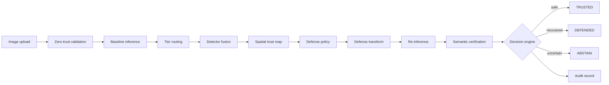

# ARGUS-AEGIS

ARGUS-AEGIS is an adversarially aware computer-vision service. It places a zero-trust analysis and recovery pipeline between an image upload and a vision model. The service does not treat a single prediction as proof: it inspects the input, combines detector evidence, localizes suspicious regions, chooses a defense, re-runs inference, verifies consistency, records an audit event, and can abstain when trust is not established.

This repository contains the complete working MVP: FastAPI backend, React dashboard, attack generation, detector fusion, trust maps, defense strategies, semantic verification, audit logging, offline learning utilities, robust-model training, calibration, evaluation, and security hardening.

## Current Status

The implementation is functional and tested, but it is not a claim of certified adversarial robustness. The current benchmark deliberately exposes weaknesses in iterative attacks and recovery so that future improvements can be measured honestly.

- Backend tests: `124 passed`.
- Frontend: Vite build and Vitest test suite.
- Backend URL: `http://localhost:8000`.
- Frontend URL: `http://localhost:5173`.
- Main live endpoint: `POST /api/v1/analyze`.
- Final states: `TRUSTED`, `DEFENDED`, and `ABSTAIN`.

## What It Does



The pipeline is organized into these stages:

1. Validate and sanitize the uploaded image under configured resource limits.
2. Run the frozen ImageNet-1000 ResNet-18 baseline.
3. Route defended Imagenette classes to the robust specialist when applicable.
4. Run feature squeezing, frequency, confidence-instability, and saliency detectors.
5. Fuse detector evidence into a bounded attack score.
6. Build a spatial trust map and connected suspicious regions.
7. Select an appropriate defense such as transformation, masking, inpainting, or purification.
8. Re-run the relevant model on the defended image.
9. Compare object, geometry, scene, and spatial evidence.
10. Return one final state and a tamper-evident audit record.

## Repository Layout

```text
backend/app/api/          FastAPI routes and typed request/response schemas
backend/app/attacks/      FGSM, PGD, patch, and attack-zoo adapters
backend/app/detectors/    Evidence-producing adversarial detectors and scorer
backend/app/defense/      Defense policies and image transformations
backend/app/evaluation/   Evaluation runners and report generation
backend/app/learning/     Dataset classes, splits, and robust training
backend/app/models/       Baseline, robust, person, and tier-routing models
backend/app/pipeline/     End-to-end orchestration and decision engine
backend/app/trust/        Trust maps and suspicious-region localization
backend/app/verification/ Semantic and spatial consistency checks
backend/tests/            Unit, integration, and security tests
frontend/src/             React dashboard, pages, services, and types
data/                     Samples, manifests, audit records, and outputs
docs/                     Architecture, API, testing, security, and evaluation
scripts/                  Setup, demos, training, calibration, and evaluation
```

## Requirements

- Python 3.11 or newer.
- Node.js 20 or newer and npm.
- Git.
- Docker Desktop is optional.
- A CPU works for the demos and tests. Training and attack suites are much faster with a CUDA-enabled PyTorch installation.

## Installation

From the repository root:

```powershell
python -m venv backend/.venv
backend\.venv\Scripts\Activate.ps1
python -m pip install --upgrade pip
python -m pip install -r backend/requirements.txt

cd frontend
npm install
cd ..
```

On macOS/Linux, activate with `source backend/.venv/bin/activate` and use the equivalent shell scripts shown below.

Optional configuration can be enabled by copying `.env.example` to `.env`. The application has safe defaults for local development; `.env` is ignored by Git and should contain deployment-specific values only.

## Run Locally

Open two terminals from the repository root:

```powershell
.\scripts\run_backend.ps1
.\scripts\run_frontend.ps1
```

Or run the processes directly:

```powershell
python -m uvicorn app.main:app --app-dir backend --reload --port 8000
cd frontend
npm run dev
```

Then open [http://localhost:5173](http://localhost:5173). The API health endpoint is [http://localhost:8000/health](http://localhost:8000/health), and interactive API documentation is available at [http://localhost:8000/docs](http://localhost:8000/docs).

## Docker

The compose file runs both services:

```powershell
docker compose up --build
```

The backend container is exposed on port `8000`; the frontend is exposed on port `5173`. Stop the stack with `docker compose down`.

## Main API Workflows

The canonical endpoint runs the complete chain:

```powershell
curl.exe -X POST http://localhost:8000/api/v1/analyze `
  -F "image=@data/samples/test.jpg" `
  -F "mode=standard"
```

The response includes the baseline and routed predictions, attack score, detector evidence, trust-map summary, selected defense, verification results, final state, tier, optional person detections, and audit identifiers.

Focused endpoints are available for development and demos:

```powershell
# Generate an attack
curl.exe -X POST http://localhost:8000/api/v1/attacks/generate `
  -F "image=@data/samples/test.jpg" -F "attack=fgsm" -F "epsilon=0.01"

# Analyze detector evidence
curl.exe -X POST http://localhost:8000/api/v1/detection/analyze `
  -F "image=@data/samples/test.jpg"

# Build a trust map
curl.exe -X POST http://localhost:8000/api/v1/trust-map/analyze `
  -F "image=@data/samples/test.jpg"

# Apply a defense
curl.exe -X POST http://localhost:8000/api/v1/defense/apply `
  -F "image=@data/samples/test.jpg"
```

Supported attacks are FGSM, PGD, localized adversarial patches, and optional unseen-family adapters through the attack zoo. API limits bound epsilon, iterations, patch size, image dimensions, and request resources.

## Recognition Tiers

ARGUS uses two complementary recognition tiers:

- **Baseline tier:** frozen ImageNet-1000 ResNet-18, available for any input.
- **Robust tier:** a specialist trained on ten Imagenette classes, used inside the defense loop when the request routes to a defended class.

The defended classes are tench, English springer spaniel, cassette player, chain saw, church, French horn, garbage truck, gas pump, golf ball, and parachute. The authoritative list is in [backend/app/learning/classes.py](backend/app/learning/classes.py).

Human detection is a separate YOLOv8 tier. When its dependency and weights are available, it returns `person` detections with bounding boxes and confidence values. It is detection, not part of the ten-class robust accuracy metric. If the optional dependency is unavailable, the pipeline falls back without breaking the request.

## Attack Lab and Demos

These commands assume the virtual environment is active:

```powershell
python scripts/demo.py
python scripts/demo_attack.py --image data/samples/test.jpg --attack fgsm
python scripts/demo_defense.py --image data/samples/test.jpg
python scripts/demo_trust_map.py --image data/samples/test.jpg
python scripts/demo_verification.py --image data/samples/test.jpg
python scripts/demo_argus_aegis.py --image data/samples/test.jpg
```

The dashboard also exposes upload, analysis, Attack Lab, detailed evidence, and persisted audit-trail views. Generated demo artifacts are written under the data output directories and should not be treated as benchmark results.

## Robust Training and Evaluation

The rigorous workflow keeps train, validation, and test data disjoint. The test split is not used for detector tuning or model selection.

### 1. Prepare data and splits

Download and prepare Imagenette with `scripts/prepare_imagenette.py`, then create deterministic per-class splits:

```powershell
python scripts/make_splits.py
```

The split manifest records source identity and hashes so overlap can be checked. See [docs/robustness_workflow.md](docs/robustness_workflow.md).

### 2. Generate attacks

Generate attacks against the model that will actually be evaluated:

```powershell
python scripts/generate_attack_suite.py --model-tag baseline --splits val --attacks fgsm,pgd,patch
python scripts/generate_attack_suite.py --model-tag robust --splits val,test --attacks fgsm,pgd,patch
```

FGSM and PGD are evaluated over an epsilon grid. Patch generation stores masks for offline localization metrics. Unseen attack families are reserved for final generalization evaluation and never used for calibration.

### 3. Train the robust specialist

```powershell
python scripts/train_robust_model.py `
  --clean-root data/robust/splits/train `
  --val-root data/robust/splits/val `
  --epochs 8 --batch-size 32 --attack-mode fgsm
```

Training supports clean, FGSM, and PGD-2 modes. Validation tracks clean and adversarial accuracy, and checkpoint selection uses their harmonic mean rather than clean accuracy alone. The checkpoint is written to `data/models/robust_model.pt`.

### 4. Calibrate detectors on validation only

```powershell
python scripts/calibrate_detectors.py --model-tag robust
```

Calibration searches detector weights and thresholds under an FPR constraint of 20%, using the objective `F1 - 0.25 * FPR`. The resulting `data/models/detector_calibration.json` is loaded by the detection pipeline.

### 5. Run the held-out test once

```powershell
python scripts/run_final_evaluation.py --model-tag robust
```

The report includes clean and robust accuracy, attack success, detection by attack family and strength, recovery, abstention, latency, patch IoU, and unseen-family results. Do not retune against the generated test report; create a fresh split if the evaluation protocol changes.

For the full reproducible chain, use:

```powershell
.\scripts\post_training_chain.sh
```

The detailed protocol and threat-model caveats are documented in [docs/robustness_workflow.md](docs/robustness_workflow.md) and [docs/robustness_report.md](docs/robustness_report.md) when a report has been generated.

## Offline Learning Workbench

Learning utilities are deliberately offline. They mine hard negatives from audit records, evolve bounded attack configurations, evaluate candidates, and apply a validation gate. They do not silently modify production models or live thresholds:

```powershell
python scripts/mine_hard_negatives.py
python scripts/run_learning_cycle.py
python scripts/run_attack_evolution.py --image data/samples/test.jpg --attack pgd --generations 3 --population 20 --seed 42
python scripts/validate_candidate.py --metrics candidate_metrics.json
```

## Security Model

Security controls include zero-trust image validation, content and resource limits, structured errors, rate limiting for expensive routes, CORS settings, security headers, safe readiness checks, and tamper-evident audit hashes. Run the local security checks with:

```powershell
python scripts/security_check.py
```

This is an application hardening layer, not a certification or a substitute for a production security review. Keep secrets and deployment credentials out of source control.

## Testing

Run the complete validation from the repository root:

```powershell
.\scripts\run_tests.ps1
```

Or run the suites directly:

```powershell
cd backend
pytest
cd ..\frontend
npm run build
npm run test:run
```

The backend suite covers attacks, API integration, the full pipeline, tier routing, robust training, calibration, reports, security, trust, verification, and model behavior. Frontend tests cover the dashboard and its interaction states. See [docs/test_matrix.md](docs/test_matrix.md) and [docs/testing.md](docs/testing.md).

## Important Limitations

- The robust specialist only covers the pinned ten Imagenette classes.
- Detector scores are evidence, not calibrated probabilities or certificates.
- Person detection depends on the optional YOLOv8 package and weights.
- CPU execution is suitable for demos but slow for large attack suites.
- A successful end-to-end pipeline does not mean every adversarial attack is detected or recovered.
- Benchmark numbers are valid only with the dataset split, model checkpoint, calibration file, and attack parameters that produced them.

## Further Documentation

- [API reference](docs/api.md)
- [Architecture](docs/architecture.md)
- [Development guide](docs/development.md)
- [Security design](docs/security.md)
- [Evaluation protocol](docs/evaluation.md)
- [Learning loop](docs/learning_loop.md)
- [Robustness workflow](docs/robustness_workflow.md)
- [Testing guide](docs/testing.md)
- [Demo script](docs/demo_script.md)
- [Pitch script](docs/pitch_script.md)

## License

No license file is currently declared in this repository. Add the intended license before distributing the project outside its current GitHub repository.
